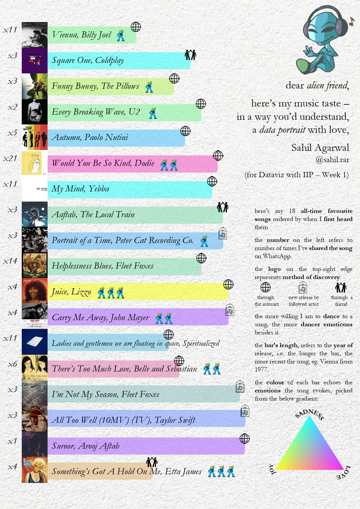

# Week 1: DataViz with IIP

You have made an alien friend from Mars.
They are curious about your life. The catch is - they don’t understand human text but do understand numbers, shapes, geometry, colors, symbols, and signs.
Create a data portrait that helps your alien friend understand some aspect of your life -
(ex. friendship / music taste / personality / habits / relationships / ambition)
Constrain: You have to include at least one data point that is qualitative, one that is quantitative.

[final p5.js](https://editor.p5js.org/Sahil_Agarwal/full/hb1mVgQXb)

- basic concept: centered around my [all time favourites playlist](https://open.spotify.com/playlist/3kW1TH8iSikbslp4YunyNy?si=13a57ac3bd2949a7) due to right amount of songs
- goals:
  - [x] qualitative data point: emotions
    - express in a unique way: triple gradient
    - has some conclusion: none, expected a pattern to form
  - [x] quantitative data point: number of forwards
    - use interesting source: whatsapp chats
    - has some conclusion: forwarded songs more in 2019-2020, compared to now and earlier
  - [x] incorporate a new perspective: triple gradient design
  - [x] aesthetically pleasing
  - [x] incorporate element outside of comfort zone: emoji
