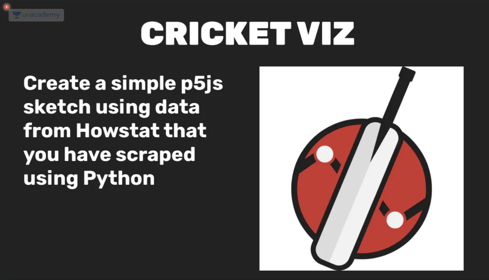

# Week 4: DataViz with IIP

- basic concept: create a map showing area covered by one players's records, i.e. their realm of dominance
- process:
  - collect data using Jupyter (all the .json files)
  - using p5 to map the data suitably
  - making the design on word, adding the country border, and pictures 
- hours spent: 3 hours