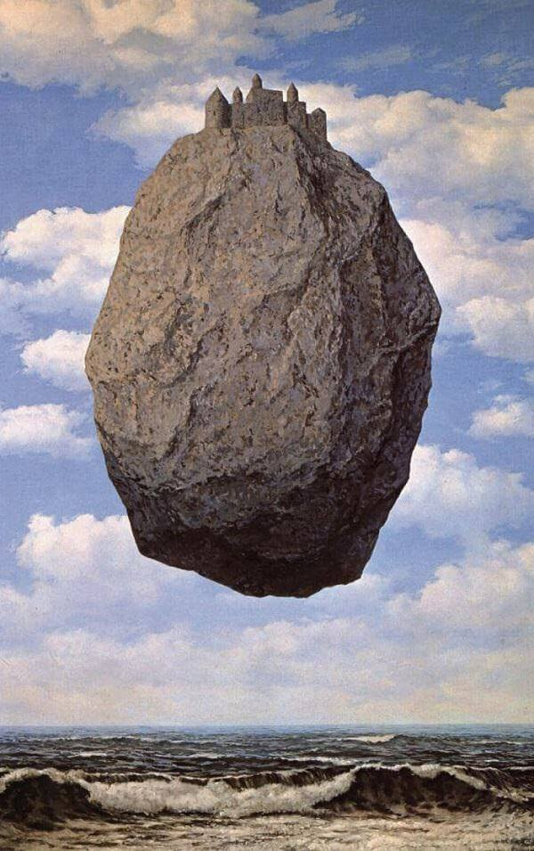

# Week 5: DataViz with IIP

- basic concept: write on artwork, and the design elements noticed
- process:
  - discuss with friends:
    - [ ] on call with Sitesh: confirm sending him  and writing on a digital artwork he will later send
    - [ ] on chat with Vani Ma'am: confirm sending her an Indian artwork, and receiving one in return
  - edit to fit the design rules
  - write on the emotional aspect 
- hours spent: 1.5 hours